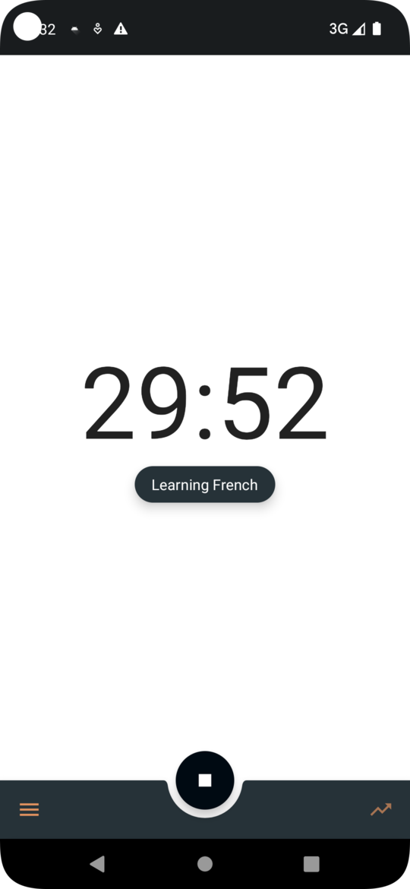
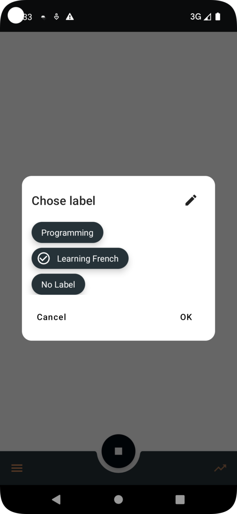
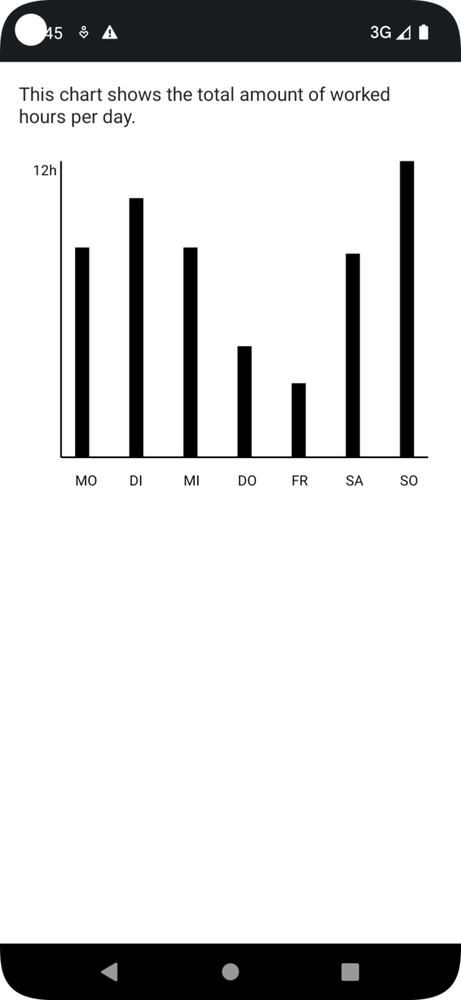
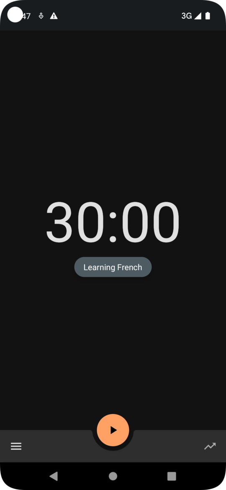

# SimplePomodoro

This is a pomodoro timer app for Android using:
- Dagger HILT for dependency Injection
- Jetpack Compose for the UI
- Room Database to save how much time was spent on which workpackage (see below feature "labels")
- Foreground Service for the timer

This project is unfinished. However, the following features work:
- Start/stop/pause the pomodoro timer (notification is shown with the time remaining)
- Create and manage multiple labels for your work.
- Statistics screen with a bar chart showing the hours worked per day
- Dark and light theme

This project is unfinished as I started working on a new pomodor timer app running on iOS and Android using Kotlin Multiplatform (KMP). The project can be found [here](https://github.com/maximilianproell/compose-multiplatform-pomodoro)

## Screenshots

